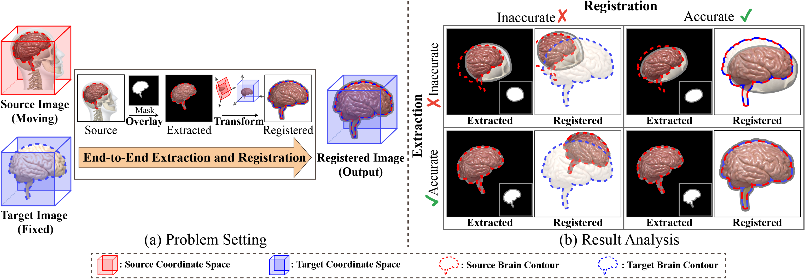
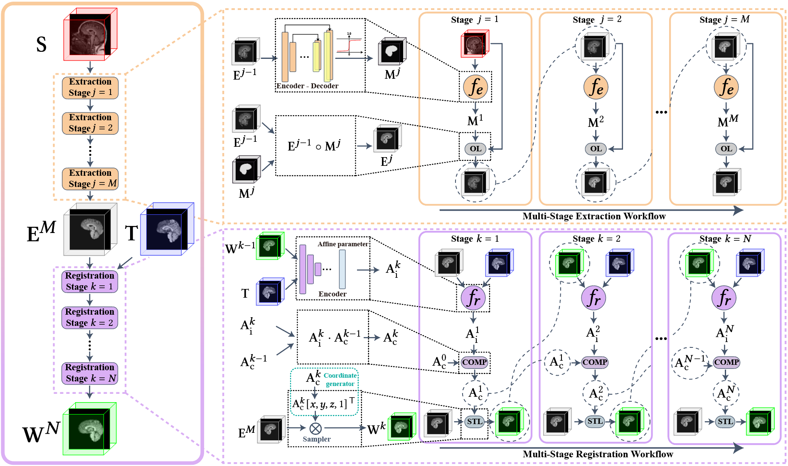

# ERNet

Anonymous repository for ERNet: An End-to-End Approach for Unsupervised Joint Extraction and Registration in Neuroimaging Data. This repository contains the implementation of ERNet.

### Unsupervised Joint Extraction and Registration Problem


### Network Architecture


## File listing

The corresponding files contain the source code and sample data of ERNet.

+ __dataset__ : Sample dataset for code test
+ __main.py__ : Main code for ERNet training
+ __model.py__ : Supporting models
+ __preprocess_data.py__ : Using for preprocess neuroimaging data
+ __train.py__ : Supporting training
+ __utils.py__ : Supporting functions

Note that all public datasets used in the paper can be found here:
+ __[LPBA40](https://resource.loni.usc.edu/resources/atlases-downloads/)__ 
+ __[CC359](https://sites.google.com/view/calgary-campinas-dataset/home)__ 
+ __[IBSR](https://www.nitrc.org/projects/ibsr)__ 

Raw data can be preprocessed via preprocess_data.py.

## Instructions on training ERNet

The following script is for training:

```
python main.py
```
<b>Parameters:</b>

+ __main.py__ :

	+ __train_set_name__ : file name of training set, default "LPBA40_train_sample.npy"
	+ __val_set_name__ : file name of validation set, default "LPBA40_val_sample.npy"
	+ __test_set_name__ : file name of test set, default "LPBA40_test_sample.npy"
	+ __dice_label__ :  dataset name of anatomical label, default "LPBA40"
	+ __fixed_set_name__ :  dataset name of the target (fixed) image, default "LPBA40"
	+ __reg_loss_name__ :  training similarity loss function , default "NCC"
	+ __gamma__ :  threshold of sigmoid function , default 10
	+ __lamda_mask__ :  value of mask smoothing regularization parameter, default 1.0
	+ __mask_smooth_loss_func__ :  loss function of mask smoothing, default first_Grad("l2")
	+ __ext_stage__ :  number of stages of extraction, default 5
	+ __reg_stage__ :  number of stages of registration, default 5
	+ __if_train_aug__ :  apply data augmentation during the training, default True
	+ __batch_size__ : batch size, default 1
	+ __img_size__ : size of input images, default 96
	+ __num_epochs__ : number of epochs, default 1000
	+ __learning_rate__ : learning rate, default 0.000001
	+ __save_every_epoch__ : saving interval for results, default 1
	+ __save_start_epoch__ : start point for results saving, default 0
	+ __model_name__ : model, default ERNet(img_size, ext_stage , reg_stage, gamma)


## Result
The results can be find after training.
+ __loss_log__ :
    + __model_name.txt__ : log file of the model
+ __model__ :
    + __model_name.pth__ : saved model
+ __sample_img__ :
    + __o__ : target images
    + __t__ : source images
	+ __s_stage__ : extracted images by stage
	+ __s_stage_mask__ : mask of extracted images by stage
    + __r_stage__ : warped (registered) images by stage